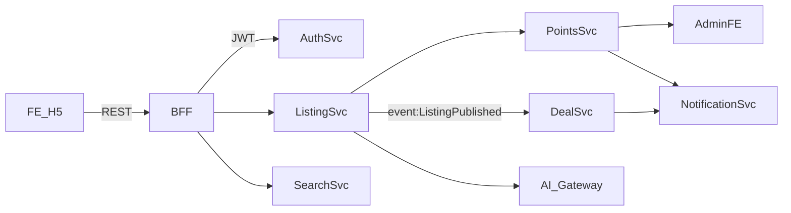

# Design Document

## Overview
该设计面向智能供需信息撮合平台的 MVP，实现“微信+手机号双因子认证 → 发布/购买联系方式 → 累计成交反馈 → 搜索增强 → 人工充值提醒 → DeepSeek AI 辅助”完整闭环。前端为移动优先 H5 + 管理后台，后端按领域拆分 Auth、Listing、Deal、Search、Points、AI Gateway 六个服务，统一经 API Gateway 暴露。所有写操作均通过事件总线（Kafka/Redis Stream）记录审计，积分/成交采用分布式事务（本地事务+Outbox）确保一致性。

## Steering Document Alignment

### Technical Standards (tech.md)
- 后端遵循“微服务 + REST + JWT”的标准，服务以 NestJS / Spring Boot 风格实现，日志/监控结构遵循 tech.md 要求（JSON 日志、Prometheus 指标）。
- 鉴权流程按 tech 标准使用 OAuth 2.0 + JWT，所有敏感字段 AES 加密后存储，与PRD一致。
- 深度调用外部AI走独立 Gateway，符合 tech.md 对第三方集成“隔离+熔断”的规范。

### Project Structure (structure.md)
- 仓库按 `/apps/frontend`, `/apps/admin`, `/services/*`, `/shared` 组织；设计中所有模块沿用该分层：
  - `/services/auth` 负责微信+手机号绑定、JWT颁发。
  - `/services/listing` 覆盖发布、自动复制、有效期控制。
  - `/services/deal` 负责累计成交统计与提醒。
  - `/services/search` 提供统一搜索API（模糊/拼音/历史）。
  - `/services/points` 管理积分账本和充值提醒。
  - `/services/ai-gateway` 统一封装 DeepSeek API。
  - `/shared` 提供DTO、事件定义、加密工具。

## Code Reuse Analysis

### Existing Components to Leverage
- **Auth 模块**：复用现有 JWT 颁发和短信验证码逻辑，只需扩展微信 OAuth 流程和双因子检查。
- **积分账本 (Points Ledger)**：沿用现有记账+流水模型，扩展新的交易类型（发布、查看、重新上架、充值人工确认）。
- **通知中心**：接入已有 Toast/站内信/企业微信机器人发送能力，用于提醒积分不足、充值待审、成交反馈。
- **列表组件**：前端复用现有卡片组件，额外增加“成交次数”字段。

### Integration Points
- **用户服务**：读取并更新 `users.wechat_openid / phone / total_deals`，需添加唯一性索引与设备指纹字段。
- **帖子服务**：`posts` 表增加 `total_deals`、`view_limit` 等字段；和 Deal 服务通过事件同步。
- **搜索引擎**：ES / Meilisearch 索引结构中新增 `total_deals`、`remaining_views`，并支持拼音分词器。
- **AI Gateway**：封装 DeepSeek API Key，暴露 `POST /ai/extract-listing`，返回标准 DTO，供 Listing 服务使用。

## Architecture

整体架构：
1. **前端层**：移动端 H5 + 管理后台，调用 BFF/API Gateway。
2. **服务层**：Auth、Listing、Deal、Search、Points、AI Gateway 各自自治，通过 gRPC/REST 通讯。
3. **数据层**：MySQL (主)，Redis (Session/Throttle)，ElasticSearch (搜索)，Kafka/Redis Stream (事件总线)。

### 模块关系（例）


### Modular Design Principles
- 单文件职责：例如 `listing.controller.ts` 仅处理路由，业务在 `listing.service.ts`，数据访问在 `listing.repository.ts`。
- 组件隔离：前端将“发布表单”“搜索输入”“成交反馈弹窗”等拆分独立组件，利于复用。
- 服务层分离：Auth/Points/Search 等不直接调用彼此数据库，全部通过 API/事件交互。
- 工具模块化：加密、拼音匹配、剪贴板封装为 `/shared/utils/*`。

## Components and Interfaces

### Auth Service
- **Purpose:** 管理微信OAuth、手机号绑定、登录 JWT。
- **Interfaces:**
  - `POST /auth/wechat/callback {code,state}` → 返回临时token。
  - `POST /auth/bind-phone {tempToken, phone, smsCode}` → 绑定并返回JWT。
  - `GET /auth/profile` → 返回绑定状态与设备指纹。
- **Dependencies:** 微信开放平台、短信服务、`users`表。
- **Reuses:** 现有短信验证码、JWT模块。

### Listing Service
- **Purpose:** 发布信息、扣积分、自动复制、有效期管理、重新上架。
- **Interfaces:**
  - `POST /posts`（包含AI辅助字段）
  - `POST /posts/:id/contact`（扣1积分并返回微信号）
  - `POST /posts/:id/republish`
  - `GET /posts?filters...`
- **Dependencies:** Points Service、AI Gateway、Deal Service（事件）、Search Service（索引更新）。
- **Reuses:** 既有帖子模型、通知中心。

### Deal Service
- **Purpose:** 处理成交反馈、累计成交次数、提醒未反馈用户。
- **Interfaces:**
  - `POST /deals/:contactId/confirm`
  - `POST /deals/:contactId/remind`
  - 事件监听：`ContactViewed`、`DealConfirmed`
- **Dependencies:** Posts/Users 表、Notification Service。

### Search Service
- **Purpose:** 提供统一搜索API，含模糊/拼音/历史/热门词。
- **Interfaces:**
  - `GET /search?q=...&filters...`
  - `GET /search/history`
  - `DELETE /search/history`
  - `GET /search/hints`
- **Dependencies:** ElasticSearch、User Service（历史同步）、运营配置服务。

### Points Service
- **Purpose:** 积分账本、充值审核、提醒。
- **Interfaces:**
  - `POST /points/consume`
  - `POST /points/recharge-request`
  - `POST /admin/points/recharge/:id/approve`
  - Webhook/事件：`RechargeTimeout`
- **Dependencies:** Notification、Admin 前端。

### AI Gateway
- **Purpose:** 封装 DeepSeek API，提供超时/熔断/日志。
- **Interfaces:**
  - `POST /ai/listing-extract {title, description}`
- **Dependencies:** DeepSeek HTTP API。

## Data Models

### Users
```
users (
  id BIGINT PK,
  phone VARCHAR(11) UNIQUE,
  wechat_openid VARCHAR(64) UNIQUE,
  wechat_unionid VARCHAR(64) NULL,
  device_fingerprint VARCHAR(128) NULL,
  total_deals INT DEFAULT 0,
  points INT DEFAULT 100,
  status TINYINT DEFAULT 1,
  created_at/updated_at TIMESTAMP
)
```

### Posts
```
posts (
  id BIGINT PK,
  user_id BIGINT,
  title VARCHAR(100),
  keywords VARCHAR(200),
  price DECIMAL(10,2),
  trade_type TINYINT,
  description TEXT,
  remaining_views INT DEFAULT 10,
  total_deals INT DEFAULT 0,
  status TINYINT DEFAULT 1,
  expire_at DATETIME,
  view_count INT,
  created_at/updated_at
)
```

### Contact Views
```
contact_views (
  id BIGINT PK,
  post_id BIGINT,
  buyer_id BIGINT,
  seller_id BIGINT,
  deducted_points INT,
  copied BOOLEAN,
  copied_at DATETIME,
  confirm_status TINYINT DEFAULT 0,
  confirm_payload JSON,
  confirm_deadline DATETIME,
  created_at
)
```

### Point Transactions
```
point_transactions (
  id BIGINT PK,
  user_id BIGINT,
  change_type ENUM('publish','view','republish','recharge','bonus'),
  amount INT,
  balance_after INT,
  related_id BIGINT,
  description VARCHAR(200),
  created_at
)
```

### Recharge Tasks
```
recharge_tasks (
  id BIGINT PK,
  user_id BIGINT,
  amount INT,
  voucher_url VARCHAR(255),
  status ENUM('pending','approved','rejected','timeout'),
  assigned_admin BIGINT NULL,
  remind_count INT DEFAULT 0,
  created_at, updated_at
)
```

### Search History
```
search_history (
  id BIGINT PK,
  user_id BIGINT,
  keyword VARCHAR(100),
  source ENUM('manual','suggestion'),
  created_at,
  UNIQUE(user_id, keyword)
)
```

## Error Handling

1. **微信授权失败/超时**
   - Handling: 返回错误码+重试链接，记录失败次数，超过阈值触发告警。
   - User Impact: Toast“授权失败，请重试或稍后再试”。

2. **积分扣减失败**
   - Handling: 回滚发布/查看动作，记录审计日志；如果是服务不可用，进入补偿队列重试。
   - User Impact: 提示“积分扣减失败，稍后再试，未扣款”。

3. **AI 服务超时/异常**
   - Handling: 返回默认提示“请手动填写”，并记录error+降级策略；熔断期间直接跳过AI调用。
   - User Impact: 表单显示“AI暂不可用，请手动填写”。

4. **充值审核超时**
   - Handling: 定时任务扫描 pending>30min 的记录，发送二次提醒并在后台待办页高亮。
   - User Impact: 用户端显示“正在加急处理，请稍候”，并可联系客服。

## Testing Strategy

### Unit Testing
- Auth 服务：微信回调校验、绑定逻辑、JWT 生成。
- Listing 服务：表单校验、积分扣减、自动复制失败重试、重新上架逻辑。
- Deal 服务：累计成交计数、提醒调度、事件监听。
- Search 服务：关键词/拼音匹配器、历史存储与裁剪。
- Points 服务：记账幂等、充值提醒调度。
- AI Gateway：超时/重试/熔断策略。

### Integration Testing
- “发布→扣积分→写索引→AI辅助日志”闭环测试。
- “查看联系方式→扣积分→写 contact_views → Deal 提醒”流程。
- “充值请求→后台审批→积分到账+通知”流程。
- “搜索输入→历史记录→后台热门词配置”整体链路。

### End-to-End Testing
- 用户首次注册并发布、他人查看、双方确认成交、累计次数在列表展示。
- 用户多次搜索（含拼音/模糊）并清空历史。
- 用户提交充值，后台管理员在提醒列表中审批，用户端收到积分到账提示。
- DeepSeek 服务不可用时的降级体验验证。
