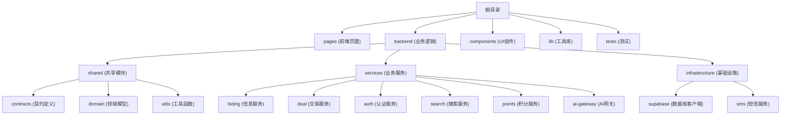

# C2C 信息集市项目

## 变更记录 (Changelog)

- 2025-11-21: 初始化项目文档，分析全栈架构和技术栈

## 项目愿景

C2C 信息集市是一个基于 Next.js 的全栈应用，为用户提供信息发布、搜索、交易和积分管理的平台。项目采用现代化的技术架构，注重代码质量和可维护性。

## 架构总览

### 技术栈
- **前端框架**: Next.js 14.2.33 (React 18)
- **编程语言**: TypeScript 5.9.3
- **数据库**: Supabase (PostgreSQL)
- **测试框架**: Jest + ts-jest
- **认证系统**: 自定义 SMS + 密码双认证
- **部署平台**: Vercel

### 项目结构
```
codex本地/
├── pages/                 # Next.js 页面和 API 路由
│   ├── api/              # 后端 API 端点
│   ├── auth/             # 认证相关页面
│   └── ...               # 其他页面组件
├── backend/              # 核心业务逻辑层
│   ├── shared/           # 共享模块和工具
│   ├── services/         # 业务服务
│   └── infrastructure/   # 基础设施层
├── components/           # React 组件
├── lib/                  # 服务器端工具库
├── tests/                # 测试文件
└── styles/               # 样式文件
```

### 模块结构图



## 模块索引

| 模块 | 路径 | 职责 | 主要语言 |
|------|------|------|----------|
| 认证模块 | backend/services/auth | 用户登录、注册、SMS验证 | TypeScript |
| 信息服务 | backend/services/listing | 信息发布、管理、搜索 | TypeScript |
| 交易服务 | backend/services/deal | 联系方式购买、交易确认 | TypeScript |
| 搜索服务 | backend/services/search | 信息搜索、历史记录 | TypeScript |
| 积分系统 | backend/services/points | 积分管理、充值、流水 | TypeScript |
| AI网关 | backend/services/ai-gateway | AI服务集成（DeepSeek） | TypeScript |
| 前端页面 | pages/** | 用户界面展示 | TypeScript/React |
| 共享模块 | backend/shared/** | 公共类型、工具、基础设施 | TypeScript |

## 运行与开发

### 环境要求
- Node.js (支持 ES2020)
- npm 或 yarn
- Supabase 账户和项目配置

### 开发命令
```bash
# 安装依赖
npm install

# 启动开发服务器
npm run dev

# 构建生产版本
npm run build

# 启动生产服务器
npm run start

# 运行测试
npm test

# 代码检查 (待实现)
npm run lint
```

### 环境变量配置
项目依赖以下环境变量：
- `SUPABASE_URL`: Supabase 项目 URL
- `SUPABASE_SERVICE_ROLE_KEY`: Supabase 服务密钥
- `SUPABASE_ANON_KEY`: Supabase 匿名密钥

## 测试策略

### 测试结构
- **单元测试**: 位于 `tests/services/` 目录，使用 Jest + ts-jest
- **集成测试**: 测试各服务间的交互
- **E2E测试**: 位于 `tests/e2e/` 目录，测试完整用户流程

### 测试配置
- 测试环境: Node.js
- 覆盖率收集: 已启用，输出到 `coverage/` 目录
- 测试根目录: `backend/` 和 `tests/`

### 运行测试
```bash
# 运行所有测试
npm test

# 运行测试并生成覆盖率报告
npm test -- --coverage
```

## 编码规范

### TypeScript 配置
- 启用严格模式和装饰器支持
- 路径别名: `backend/*` 和 `src/*` 指向 `backend/*`
- 启用 `noUncheckedIndexedAccess` 和 `exactOptionalPropertyTypes`

### 项目约定
- 使用依赖注入模式组织服务
- 遵循领域驱动设计（DDD）架构
- API 路由遵循 RESTful 规范
- 使用 TypeScript 装饰器进行数据验证

### 代码组织
- **服务层**: 业务逻辑实现
- **控制器层**: API 接口定义
- **仓储层**: 数据访问抽象
- **契约层**: 接口和类型定义

## AI 使用指引

### 项目架构理解
- 这是一个 C2C 信息交易平台，核心业务围绕信息发布、搜索和交易
- 采用 Next.js 全栈架构，前后端代码在同一项目中
- 使用 Supabase 作为后端数据库和认证服务

### 开发建议
1. **新增 API 路由**: 在 `pages/api/` 下创建新文件，并在 `lib/server/controllers.ts` 中注册控制器
2. **新增业务服务**: 在 `backend/services/` 下创建服务，实现相应的接口契约
3. **数据库操作**: 通过 Supabase 客户端进行，使用仓储模式封装数据访问
4. **测试**: 为新功能编写对应的单元测试和集成测试

### 关键注意事项
- 所有业务逻辑应放在 `backend/services/` 中，避免在 API 路由中直接处理业务
- 使用 `backend/shared/contracts/` 中定义的类型接口进行模块间通信
- 认证相关的操作需要通过 JWT 令牌验证
- 积分系统的交易操作需要保证原子性

## 相关文件清单

### 核心配置文件
- `package.json`: 项目依赖和脚本定义
- `tsconfig.json`: TypeScript 编译配置
- `jest.config.cjs`: Jest 测试配置
- `next.config.js`: Next.js 框架配置
- `vercel.json`: Vercel 部署配置

### 关键入口文件
- `pages/_app.tsx`: 应用程序根组件
- `lib/server/controllers.ts`: 控制器注册中心
- `backend/infrastructure/supabase/client.ts`: 数据库客户端

### 主要服务实现
- `backend/services/auth/sms.controller.ts`: 认证控制器
- `backend/services/listing/listing.service.ts`: 信息服务实现
- `backend/services/deal/deal.service.ts`: 交易服务实现
- `backend/services/search/search.service.ts`: 搜索服务实现

## 部署说明

项目配置为 Vercel 自动部署：
- 框架: Next.js
- 构建命令: `npm run build`
- 安装命令: `npm install`

部署前确保所有环境变量已正确配置在 Vercel 项目设置中。